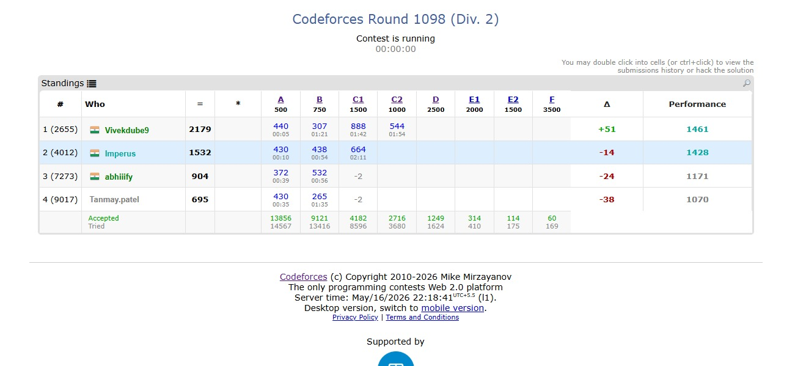

# RatingPredictor

A Chrome Extension for predicting live Codeforces rating changes and performance ratings directly inside contest standings.

RatingPredictor is a browser-side rating prediction engine built for Codeforces. It estimates rating deltas and performance ratings for ongoing contests by approximating the official Codeforces rating methodology. Predictions are injected directly into the standings page, allowing participants to monitor their expected rating movement in real time without waiting for official updates.

Unlike many web-based predictors, the extension executes entirely inside the browser and requires no external backend infrastructure. The project was developed to explore the engineering challenges behind scalable rating prediction systems, including browser extension development, large-scale ranking algorithms, asynchronous API orchestration, efficient expected-rank computation, and real-time DOM manipulation.

---

# Preview




---

# Motivation

One of the most interesting aspects of competitive programming contests is the uncertainty surrounding rating changes after the contest ends. While several unofficial predictors already exist, this project was created to understand and engineer the complete prediction pipeline rather than simply reproducing existing solutions.

The project focuses on building a scalable browser-side system capable of handling contests with thousands of participants while remaining responsive and lightweight.

Major engineering areas explored include:

- Browser Extension Development
- Ranking Algorithms
- Expected-Rank Computation
- REST API Optimization
- Asynchronous Programming
- Parallel Request Processing
- Browser-side Performance Optimization
- Dynamic DOM Manipulation

---

# Installation

The extension is distributed through GitHub and can be installed manually.

Clone the repository

```bash
git clone <repository-url>
```

or download it as a ZIP archive.

Open Chrome and navigate to

```
chrome://extensions
```

Enable **Developer Mode**.

Click

```
Load unpacked
```

Select the project folder.

The extension will now become active automatically on Codeforces standings pages.

---

# Usage

Open any Codeforces standings page.

Example

```
https://codeforces.com/contest/2227/standings
```

The extension automatically

- detects the contest
- downloads standings
- retrieves participant ratings
- computes predicted rating changes
- injects prediction columns into the standings

Displayed information includes

- Predicted Rating Delta (Δ)
- Estimated Performance Rating

The extension currently supports

- Official Standings
- Friends Standings

without requiring any manual interaction.

---

# Internal Working

The prediction pipeline consists of several stages.

### 1. Standings Collection

The extension requests contest standings using the Codeforces

```
contest.standings
```

API.

This provides

- participant handles
- score
- penalty
- current ranking

---

### 2. Rating Collection

Ratings are retrieved using

```
user.info
```

The Codeforces API accepts at most **500 handles** per request.

To reduce waiting time, participant handles are divided into batches of 500 and fetched asynchronously using **five concurrent API requests**, significantly reducing total retrieval latency while respecting API limits.

---

### 3. Expected Rank Computation

After collecting participant ratings, the extension reconstructs the expected-rank computation used by the Codeforces rating system.

Instead of comparing every participant against every other participant, participant ratings are first aggregated into a histogram representing the rating distribution of the contest.

The expected rank for every rating is then computed by directly convolving this histogram with the Elo win-probability function.

To further improve performance, the rating domain is restricted to the practical Codeforces rating interval (approximately **-100 to 4100**) rather than the complete theoretical range. Since virtually every rated participant lies within this interval, the optimization substantially reduces computation while preserving prediction accuracy.

---

### 4. Rating Prediction

Using the computed expected ranks, the extension estimates

- expected seed
- performance rating
- rating delta

using the same iterative methodology employed by the official Codeforces rating algorithm.

---

### 5. Browser Integration

Finally, Chrome content scripts dynamically inject additional columns into the existing standings table without modifying the original Codeforces source code.

The resulting interface remains visually consistent with the native Codeforces design.

---

# Complexity Analysis

A straightforward implementation computes expected ranks by comparing every participant against every other participant.

For **N** contestants,

```
Time Complexity

O(N²)
```

which becomes prohibitively expensive for large contests.

Instead, participant ratings are aggregated into a histogram over a bounded rating domain.

Let

```
R = number of rating buckets
```

After restricting the practical rating interval,

```
R ≈ 4200
```

The expected-rank computation therefore becomes

```
O(R²)
```

Since **R** remains fixed regardless of contest size, the computational cost is effectively bounded for practical Codeforces contests.

The convolution performs approximately

```
4200 × 4200
≈ 17.6 million
```

operations.

---

# Performance

The extension has been tested on contests containing more than **15,000 participants**.

Measured prediction computation time (excluding API latency)

```
≈200 ms
```

for contests containing approximately **15,000 participants**.

Overall execution time is typically dominated by Codeforces API response latency rather than local computation.

Implemented performance optimizations include

- Rating-domain reduction
- Histogram-based expected-rank computation
- Direct histogram convolution
- 500-handle request batching
- Five concurrent API requests
- Asynchronous request processing
- Browser-side caching
- Efficient DOM updates

---

# Current Limitations

The extension is currently under active development.

Historical contests currently use participants' **current ratings** rather than their ratings immediately before the contest.

Consequently, predictions for old contests may differ from official historical rating changes.

This behavior is intentional during development and allows easier validation of the prediction pipeline on live contests.

Future improvements include

- Historical rating reconstruction
- Incremental rating updates
- Persistent browser caching
- Improved handling of unofficial participants
- More accurate performance estimation
- Additional optimization for extremely large contests

---

# Repository Structure

```
background/    Chrome Service Worker

content/       DOM Injection

rating/        Rating Prediction Engine

api/           Codeforces API Wrapper

util/          Utility Functions

icons/         Extension Assets

lib/           Supporting Libraries
```

---

# Technical Highlights

- Chrome Extension (Manifest V3)
- JavaScript (ES Modules)
- Browser-side Rating Prediction
- Histogram-based Expected-Rank Computation
- Rating-domain Optimization
- REST API Integration
- Parallel API Request Batching
- Asynchronous Programming
- Browser-side Caching
- Dynamic DOM Injection

---

# Author

Made with ❤️ by **Imperus**

GitHub

https://github.com/keshavraj7

---

# Project Summary

RatingPredictor is a browser-side Chrome extension that estimates live Codeforces rating changes using histogram-based expected-rank computation and optimized rating-domain reduction. The extension combines asynchronous REST API orchestration, parallel request batching, browser-side caching, and dynamic DOM manipulation to efficiently generate predictions for contests containing over **15,000 participants**, with computation completing in approximately **200 ms** after participant data retrieval.