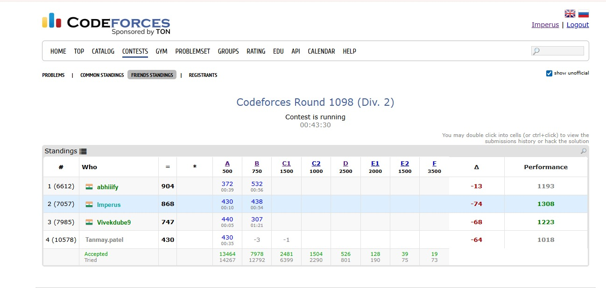

# RatingPredictor
A extension to get live rating changes based on current position of any ongoing contest or any previous contest.

Rating Predictor is a Chrome extension designed to estimate live Codeforces rating changes directly inside contest standings pages. The extension injects predicted rating deltas and estimated performance ratings into the existing Codeforces UI while a contest is still running, allowing participants to monitor approximate rating movement in real time without waiting for official rating updates.

The project was developed to explore the internal mechanics of large-scale competitive programming rating systems and to study how prediction pipelines behave under real-world constraints such as high participant counts, API latency, browser execution limits, and live DOM manipulation.

Unlike simple rank-based estimators, the extension attempts to approximate the actual Codeforces rating methodology using probabilistic expected rank calculations and performance estimation techniques inspired by Elo-style systems. The predictor is optimized using FFT (Fast Fourier Transform) based convolution methods to reduce the computational complexity of large-scale expectation calculations.



---

# Motivation

One of the most interesting aspects of competitive programming contests is the uncertainty of post-contest rating movement. While several unofficial predictors already exist, the goal of this project was not merely to replicate existing functionality, but to understand and engineer the complete pipeline from scratch.

The project focuses heavily on:
- large-scale ranking computations
- API optimization
- browser extension engineering
- asynchronous request orchestration
- performance optimization for contests with thousands of participants

The extension was specifically designed to operate directly inside the browser without requiring external backend infrastructure.

---

# Installation

The extension is currently distributed through GitHub and can be installed manually using Chrome’s Developer Mode.

First, download the repository either as a ZIP archive or by cloning it using Git.

```bash
git clone <repo-url>
```

After downloading, extract the repository to any folder on your system.

Open Chrome and navigate to:

```text
chrome://extensions
```

Enable **Developer Mode** using the toggle in the top-right corner.

Then click:

```text
Load unpacked
```

and select the extracted project folder.

The extension will now be installed locally and become active automatically on Codeforces standings pages.

---

# Usage

After installation, simply open any Codeforces contest standings page.

Example:

```text
https://codeforces.com/contest/2227/standings
```

The extension automatically:
1. detects the contest ID
2. fetches standings data
3. retrieves participant ratings
4. computes rating predictions
5. injects additional columns into the standings table

The injected columns currently include:
- predicted rating delta (Δ)
- estimated performance rating

The extension works on both:
- common standings
- friends standings

without requiring any manual interaction from the user.

---

# Internal Working

The prediction pipeline begins by querying the Codeforces API endpoint:

```text
contest.standings
```

This endpoint provides the live contest standings, including participant rank, score, penalty, and handle information.

Once standings are retrieved, the extension collects participant ratings using:

```text
user.info
```

Because large contests may contain several thousand participants, the extension implements chunked and parallelized API requests in order to reduce overall waiting time while avoiding excessive throttling from the Codeforces API.

After rating collection, the extension computes rating predictions using a probabilistic expectation model inspired by the official Codeforces rating system. The predictor estimates expected participant ranks based on pairwise win probabilities derived from rating differences.

A naive implementation of this process would require quadratic complexity:

```text
O(n²)
```

which becomes impractical for contests with thousands of users.

To address this issue, the extension uses FFT (Fast Fourier Transform) based convolution techniques to accelerate large-scale probability aggregation and expectation calculations. This significantly reduces computational overhead and allows the predictor to remain usable even for contests containing more than 10,000 participants.

After prediction generation, the extension dynamically modifies the standings table using Chrome content scripts and injects visually integrated prediction columns into the existing Codeforces interface.

---

# Performance Characteristics

The current implementation has been tested on contests with:
- 10,000+ participants

Typical runtime depends primarily on Codeforces API latency rather than local computation speed.

The FFT-based prediction engine itself executes very quickly, while most of the total runtime is spent waiting for participant rating data to be fetched from the API.

The project also explores several optimization strategies including:
- request chunking
- parallel request batching
- local caching architectures
- API throttling mitigation
- browser-side prediction pipelines

---

# Current Limitations

The extension is currently in an experimental/testing phase.

At present, the system uses current participant ratings even when predicting historical contests. This means that predictions for old contests may differ significantly from official historical rating changes because pre-contest ratings are not yet reconstructed.

This limitation currently exists intentionally in order to simplify validation of the live prediction pipeline and to test the extension behavior under ongoing contest conditions.

Future updates are planned to include:
- historical rating reconstruction
- persistent local caching
- faster incremental updates
- improved handling for unofficial participants
- more accurate performance estimation
- optimized API synchronization

---

# Repository Structure

```text
background/   → Chrome service worker and API orchestration
content/      → DOM manipulation and standings injection
rating/       → FFT-based rating prediction engine
api/          → Codeforces API wrapper
util/         → utility/helper functions
icons/        → extension assets
```

---

# Technical Highlights

This project combines several engineering domains including:
- browser extension development
- asynchronous systems programming
- large-scale ranking computations
- algorithm optimization
- FFT-based acceleration techniques
- DOM injection systems
- API orchestration and throttling management

The extension was built entirely using JavaScript and Chrome Extension Manifest V3 architecture.

---

# Author

Made with ❤️ by Imperus

GitHub:
https://github.com/keshavraj7

---

# Project Summary

Designed and developed a Chrome extension for live Codeforces rating prediction capable of handling contests with 10,000+ participants using FFT-optimized expectation calculations, asynchronous API orchestration, and browser-side ranking analysis. The project focuses on scalable rating prediction pipelines, browser extension systems engineering, and real-time competitive programming analytics.
